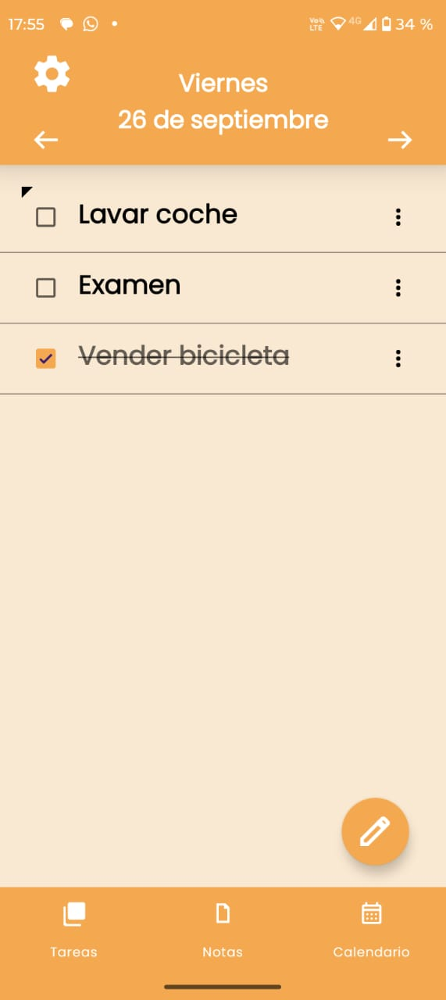
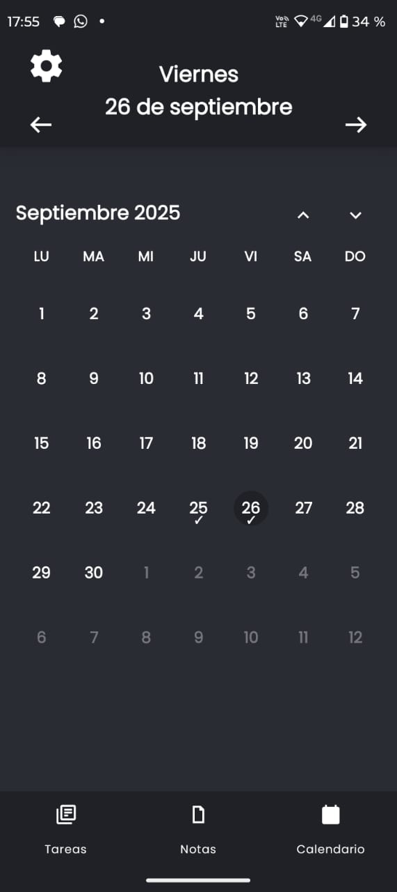
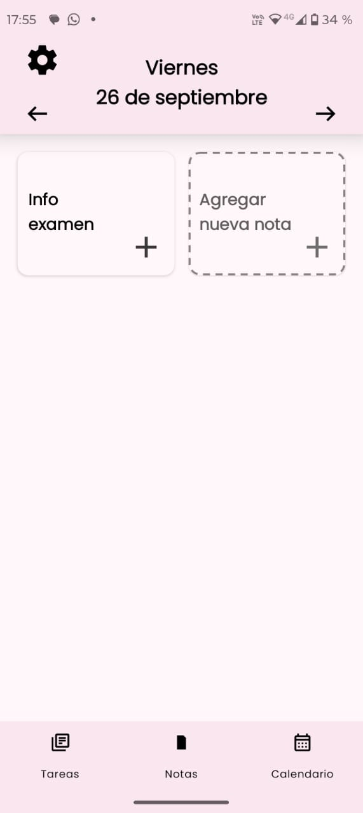
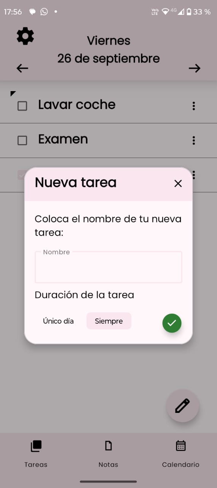
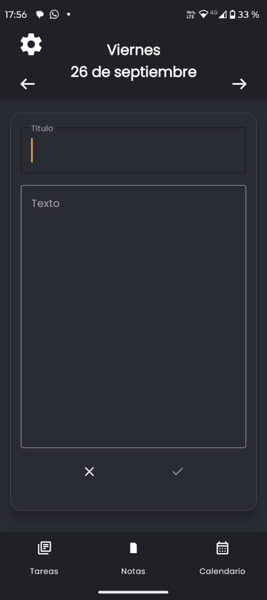
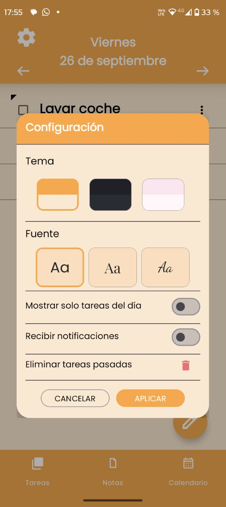

  

<h1 align="center">Notagus</h1>

  Gestor personal de <b>tareas, notas, listas y calendario</b> para Android. 
  Proyecto nativo en <b>Java</b> con <b>Room (SQLite)</b>, <b>RecyclerView</b>, <b>Material Design</b> y <b>notificaciones</b>.

  
  
  
  

---

## ✨ Funcionalidades

- ✅ **Tareas**: crear, editar, fijar, completar; subtareas; recordatorios.
- 📝 **Notas**: editor con título y cuerpo; pin/unpin.
- 📅 **Calendario**: vista mensual; tareas vinculadas por fecha.
- 📋 **Listas**: listas personalizadas con ítems chequeables.
- 🎨 **Temas**: claro, oscuro y rosa; header y FAB adaptados.
- 💾 **Persistencia**: Room con migraciones versionadas.
- 🧩 **Widget**: de tareas para la pantalla de inicio.

---

## 🧰 Herramientas y stack (nivel “complejo”)

- **Lenguaje / Plataforma**
  - Java (Android), Android SDK (`compileSdk = 36`, `minSdk = 24`)
- **Arquitectura y Persistencia**
  - Room (SQLite) con DAOs, entidades y migraciones
  - `DatabaseClient` como **Singleton** de acceso a `AppDatabase`
- **UI / UX**
  - RecyclerView + ViewHolders/Adapters
  - Fragments (Tasks, Notes, Calendar)
  - Material Components (temas: claro/oscuro/rosa), FAB, BottomNav
- **Notificaciones / Sistema**
  - NotificationManager + canales; compatibilidad API 24+
  - App Widget de tareas (provider + views + actualizaciones)
- **Build / Tooling**
  - Gradle (KTS), wrapper incluido
  - `.gitignore` para Android/Gradle
- **Pruebas**
  - `test/` (unit) y `androidTest/` (instrumentadas)

---

## 🚀 Instalación

1. Clonar el repositorio  
git clone https://github.com/Agustinpujol12/Notagus.git  

2. Abrir en Android Studio  
Esperar la indexación inicial.  

3. Sincronizar dependencias con Gradle  
(Android Studio lo propone automáticamente).  

4. Ejecutar en un dispositivo o emulador con Android 7.0 (API 24) o superior.  

---

## ⬇️ Descarga

- [APK más reciente (Releases)](../../releases)

---

## 🖼️ Capturas de pantalla

  
  
  

  
  
  

---

## 🔒 Permisos & Privacidad

- 🔔 **Notificaciones**: se utilizan únicamente para recordatorios de tareas.  
- 💾 **Almacenamiento local**: todos los datos se guardan en el dispositivo mediante Room (SQLite).  
- 🚫 **Sin conexión a servidores externos**: los datos son privados y permanecen solo en tu dispositivo.  
